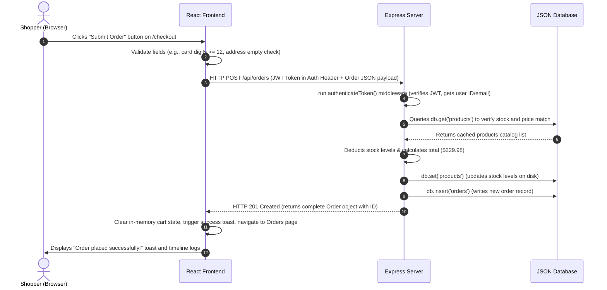
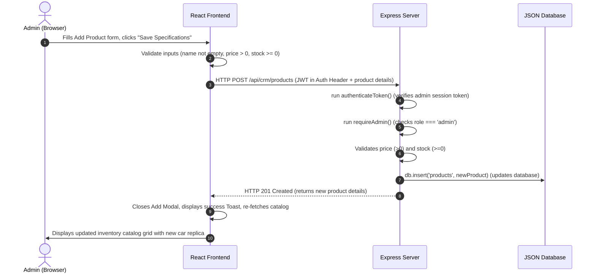

# Velocraft Car Replicas - Technical Documentation

Welcome to **Velocraft**, a full-stack car replica toy store (E-commerce) and integrated Customer Relationship Management (CRM) platform built with React, Node.js, and Express.

---

## 1. React Concepts & Architecture Explanations

Here we detail how the 5 core React concepts are implemented inside Velocraft and how they improve the application’s design, code health, and customer usability.

### A. Components
* **Most Prominent Usage**: The split of the layout into the global coordinates manager `App.jsx`, modular visual components (`Navbar.jsx`, `AuthModal.jsx`, `Notification.jsx`, `CarGraphic.jsx`), and dedicated pages (`Catalog.jsx`, `ProductDetail.jsx`, `Cart.jsx`, `Checkout.jsx`, `OrderHistory.jsx`, `SupportTickets.jsx`, `CRM.jsx`).
* **Architectural & UX Benefits**: Splitting the app into modular, standalone parts prevents the codebase from becoming an unmaintainable "monolith" of spaghetti code. The `CarGraphic` component is a prime example: by housing all complex SVG vector generation inside one component, any page (Catalog, Details, Cart, Admin low-stock dashboards) can display high-fidelity graphics with a single import line. This speeds up browser styling audits and increases loading performance (0ms local draw speed, fulfilling the request to make the website fast).

### B. Events
* **Most Prominent Usage**: Search query debounced changes (`onChange` in `Catalog.jsx`), adding to cart (`onClick` in `ProductDetail.jsx`), order status transitions (`onChange` in the Admin selector in `CRM.jsx`), and checkout form submissions (`onSubmit` in `Checkout.jsx`).
* **Architectural & UX Benefits**: Events bridge user actions and system state. Inside `Catalog.jsx`, the user's keystrokes trigger search updates, which are debounced by `setTimeout` to filter results on-the-fly. This gives the customer instant visual feedback while avoiding a flurry of backend requests on every keystroke, keeping the browser UI snappy and reducing server load.

### C. State
* **Most Prominent Usage**: The global user session, token authentication, and cart array stored in `App.jsx` (which are synchronized to `localStorage` via `useEffect`), alongside local active views inside `CRM.jsx` (`activeTab`) and `SupportTickets.jsx` (`activeTicket`).
* **Architectural & UX Benefits**: State keeps the UI in sync with user sessions. By managing the `user` and `cart` states globally in `App.jsx`, shoppers can browse products, click on detailed specifications, add them to their cart, and checkout without losing their cart items. Local view state like `activeTicket` ensures that when an admin replies to a customer, the screen re-renders automatically to show the discussion thread immediately.

### D. List Operations
* **Most Prominent Usage**: Mapping over the array of search-filtered replicas (`products.map` in `Catalog.jsx`), listing items in the cart (`cart.map` in `Cart.jsx`), rendering active inquiries (`tickets.map` in `SupportTickets.jsx`), and producing the admin's category sales chart bars (`analytics.categoryBreakdown.map` in `CRM.jsx`).
* **Architectural & UX Benefits**: List mapping lets React dynamically render UI nodes from JSON payloads. Each item in the mapped array is given a unique `key={product.id}` or `key={order.id}` attribute. This lets React's Virtual DOM track changes to specific items and update only what changed on screen rather than re-rendering the whole page, which improves performance and creates smooth visual transitions.

### E. Form Control
* **Most Prominent Usage**: The controlled input registration and login forms in `AuthModal.jsx`, the ticket creation details in `SupportTickets.jsx`, and the CRUD specification editing forms in `CRM.jsx`.
* **Architectural & UX Benefits**: Controlling input fields with React state (e.g. `value={email}` and `onChange={...}`) gives developers absolute control over what users type. For instance, in `CRM.jsx` (Inventory Control), we validate that `price` is positive and `stock` is non-negative before sending the data to the API. In `Checkout.jsx`, we verify the formatting of the shipping fields and card digits, warning the shopper immediately if there's a typo. This validation layer prevents invalid database inputs and guides users with clear error messages.

---

## 2. Node.js & Express Server Integration

The backend is built as a lightweight REST API server using **Node.js** and **Express.js**.

### Server Setup & Design Decisions
1. **ES Modules (`"type": "module"`)**: Configured in `package.json` to allow clean, modern ES6 imports (`import express from 'express'`) instead of CommonJS require syntax.
2. **In-Memory Caching (`db.js`)**: To satisfy the speed optimization requirement, the database loads `db.json` on startup. Read requests are served directly from RAM in \(O(1)\) time with zero disk operations. Writes update the in-memory array first, then use atomic file writing to save to disk.
3. **Security (JWT & Bcrypt)**: Password storage uses `bcryptjs` to hash credentials on registration. Upon logging in, the server signs a JSON Web Token (JWT) with user metadata (Name, Email, Role) using a secure signature key.
4. **Middlewares**:
   * `express.json()` handles parsing of incoming JSON payloads.
   * `cors()` allows cross-origin requests from the React frontend running on port 3000 to the Express server on port 5000.
   * `authenticateToken` extracts and verifies the bearer token from the HTTP Authorization header.
   * `requireAdmin` acts as an access control list (ACL) block to restrict CRM routes to admins only.

---

## 3. End-to-End Request & Response Flows

Here we document two complete, detailed communication cycles from the browser to the backend and back.

### Flow A: Shopper checkout transaction

1. **User Action**: The customer fills out their address and mock credit card on the `Checkout.jsx` form and clicks **Submit Order**.
2. **Frontend Validation**: The event handler `handleSubmit` prevents default action, validates that inputs are not empty, checks that the card number has at least 12 digits, and triggers a loading state.
3. **HTTP Fetch Request**: React initiates a network call:
   * **URL**: `/api/orders` (proxied to `http://localhost:5000/api/orders`)
   * **Method**: `POST`
   * **Headers**: `Content-Type: application/json`, `Authorization: Bearer <JWT_TOKEN_STRING>`
   * **Body**: JSON string containing items, shipping address, and payment method details.
4. **Server Middleware**: The Express router intercepts the request, runs `authenticateToken`, verifies the signature, and appends `req.user` details (id, name, email) to the request.
5. **Database Transaction**:
   * The server loads the catalog from `db.js`.
   * For each order item, it verifies that the product exists and that its warehouse stock is sufficient.
   * It decrements the warehouse stock levels, writes the updated catalog, and appends a new order record (status: "Pending") to `orders` with a generated ID.
6. **HTTP Response**: The server sends a status code `201 Created` with the JSON payload of the newly created order.
7. **Frontend State Updates**: React checks `res.ok`, clears the shopper's `cart` state (which automatically updates local storage), triggers a "success" notification toast, sets `currentPage` to `"orders"`, and re-renders to display the purchase logs timeline.

---

### Flow B: Admin creates a new car replica product

1. **User Action**: The admin opens the CRM portal, clicks **Catalog New Replica**, fills out details (e.g. Nissan Skyline R34, JDM, scale 1:24, price 89.99, stock 15), and clicks **Save Specifications**.
2. **Frontend Validation**: The handler `handleSaveProduct` validates that fields are complete, price is a positive decimal number, and stock is a non-negative integer.
3. **HTTP Fetch Request**: React initiates a network call:
   * **URL**: `/api/crm/products` (proxied to port 5000)
   * **Method**: `POST`
   * **Headers**: `Content-Type: application/json`, `Authorization: Bearer <JWT_TOKEN_STRING>`
   * **Body**: JSON string of replica specifications (name, brand, category, scale, price, stock, image, description).
4. **Server Authentication & Authorization**: The Express router intercepts the request, runs `authenticateToken` to decode the session, and then runs `requireAdmin`, which checks if `req.user.role === 'admin'`. If not, it blocks access with `403 Forbidden`.
5. **Database Transaction**:
   * The server runs a secondary numerical verification check on price and stock levels.
   * It invokes `db.insert('products', newProduct)`, which assigns a unique ID (`p9`) to the product, appends it to the database array, and saves the file.
6. **HTTP Response**: The server sends a status code `201 Created` with the JSON payload of the newly cataloged model.
7. **Frontend State Updates**: React checks `res.ok`, closes the creation modal, triggers a "success" notification toast, re-fetches the catalog list, and re-renders the admin view to display the new replica in the catalog grid.
